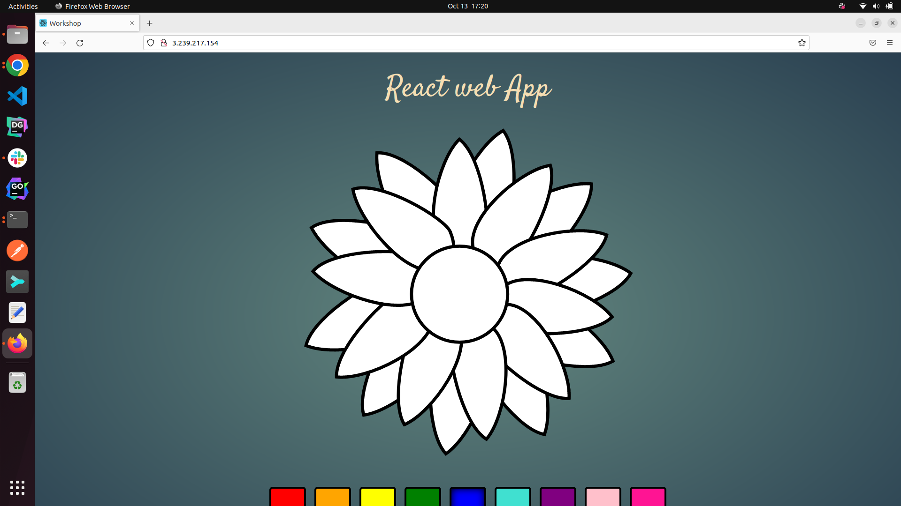

##Task:-
   - To Create an ECS Cluster and ECR repo, 
   - using Github Action build docker image of React application 
   - Push the image to ECR Repo
   - Use the image in ECS task definition
   - the app should be visible on public ip of EC2 instance

##Approach:-
   - Created an ECR repo manually
   - Created an ECS cluster,Task Defintion,Service
   - Created CI/CD pipeline to build,push and update task definition

##Errors Encountered:-
   - No ecs container was found while creating ecs cluster
   - Ecs instance role execution problem
   

##Approach to tackle Errors:-
   - Created EC2 instance manually and tried to attach it to ECS cluster(#!/bin/bash
             echo "ECS_CLUSTER=MyCluster" >> /etc/ecs/ecs.config)
       - Problem Occured:-
          - EC2 instance failed to attach
          - CPU allocation problem
          - No ECS specialized ami were available

   - Searched for Ecs specialized image, reduced the instance type to t2.micro and then attached the newly created  EC@ instance with ECS_CLUSTER
       -  Problem Occured:-
           - EC2 was successfully attached and was up and running
           - After successfull CI/CD run ,the image url was updated to task defintion, but the app was not visible on EC2 public ip (network configuration problem)
             Approach to tackle issue:-
              - Created a new security group with two inbound rules (port 22,port 80),created an EC2 instance with new security group and attached the
                 same  to Ecs cluster(failed)
              -  Edited the default  security group added new security rule( port 80,all traffic) to map the container port with
                 host port(failed)

##Final solution:-
    - Refractored the default vpc
    - attached internet gateway to default vpc to provide access to internet
    - attached all six subnet to default vpc
    - Created new ECS_CLUSTER using default vpc,selected all sic subnets 
    - Created task defintion( ECS_CONTAINER_INSTANCE was created automatically)
    - ran CI/CD (Successfull)
    - The app was visible on EC2 instance public ip address
    
